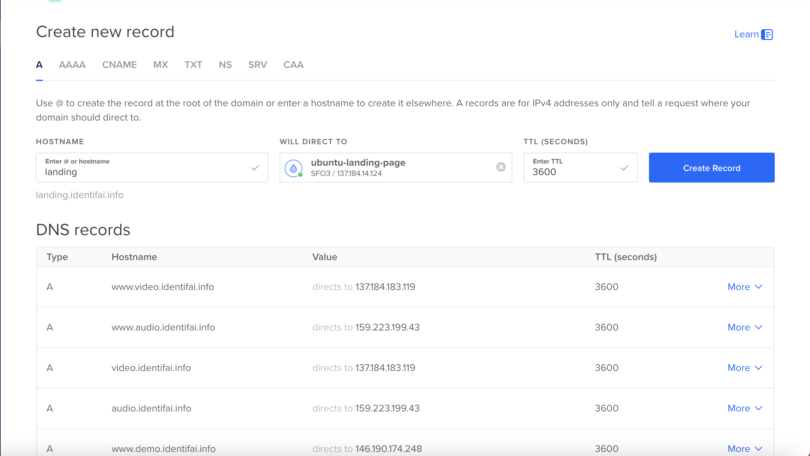
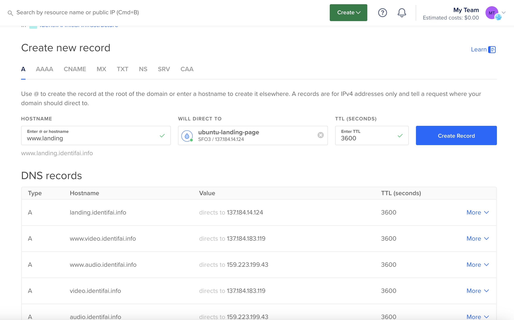
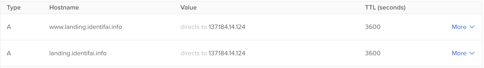

# Landing Page Code -> Production Server

## Buying a Domain (GoDaddy, etc.)
This part is relatively straight forward! You really just need to switch the nameservers over to DigitalOcean at some point but we can go into this another time
## DigitalOcean Server Setup
We can walk through this on screen share!
## DigitalOcean Domain Setup
Right now we have a identifai.info domain registered for testing out new webpages and services! Fortunately, we already have this added to DigialOcean and set up with DigitalOcean nameservers so configuring the DNS (Domain Name Service) for the test landing page should be easy.
### Configuring in DigitalOcean
#### Adding landing.identifai.info

#### Adding www.landing.identifai.info

#### What you should see on the Domain Page


## First Server Access
### Installing NGINX Webserver
Couple of quick things to install before you start getting the server set up!
```
apt install nginx
```
### Installing Python required libraries

```
apt install python3-fastapi
```

## SSL / HTTPS Configuration
This is one of the most important pieces as it allows users to access your webpage using HTTPS (secure transmission) instead of HTTP. The steps are relatively straightforward!

### Download Certbot
```
sudo apt install certbot python3-certbot-nginx
```

### Run CertBot on your domain names!
```
sudo certbot --nginx -d your_domain.com -d www.your_domain.com
```

### Create Nginx Configuration file for your domain
```
sudo nano /etc/nginx/sites-available/your_domain.com
```

### Fill in config file
```
server {
    listen 80;
    server_name your_domain.com www.your_domain.com;
    return 301 https://$host$request_uri;
}

server {
    listen 443 ssl;
    server_name your_domain.com www.your_domain.com;

    ssl_certificate /etc/letsencrypt/live/your_domain.com/fullchain.pem;
    ssl_certificate_key /etc/letsencrypt/live/your_domain.com/privkey.pem;
    include /etc/letsencrypt/options-ssl-nginx.conf; # Managed by Certbot
    ssl_dhparam /etc/letsencrypt/ssl-dhparams.pem; # Managed by Certbot

    location / {
        proxy_pass http://localhost:5678; # Wherever your fastapi server is running (we will change this later)
        proxy_http_version 1.1;
        proxy_set_header Upgrade $http_upgrade;
        proxy_set_header Connection "Upgrade";
        proxy_set_header Host $host;
        proxy_set_header X-Real-IP $remote_addr;
        proxy_set_header X-Forwarded-For $proxy_add_x_forwarded_for;
        proxy_set_header X-Forwarded-Proto $scheme;
    }
}

```

### Enable your site with Symlink
```
sudo ln -s /etc/nginx/sites-available/your_domain.com /etc/nginx/sites-enabled/
```

### Remove unneccessary default directory
```
sudo rm /etc/nginx/sites-enabled/default
```

### Test and Reload nginx
```
sudo nginx -t
sudo systemctl reload nginx
```

Bam! We are now ready to spin up our fastAPI server and start seeing live results online!

## Firewall Setup
### Setting up UFW for SSH access, and public port 80 (HTTP) and 443 (HTTPS)

#### Check Status of UFW
```
sudo ufw status
```

#### Check Applications that you can add to the firewall
```
sudo ufw app list
```

#### Allow both HTTP and HTTPS
```
sudo ufw allow 'Nginx Full'
```

#### Allow SSH access before enabling
```
sudo ufw allow ssh
```

#### Enable UFW Firewall
```
sudo ufw enable
```

#### Check Status of Firewall
```
sudo ufw status
```

## FastAPI and Directory Setup

For this we will take a look at our webserver set-up for our demo User interface that customers interact with!!

## Logging
When building a webserver for production-level use, you want to make sure that your endpoints have proper logging to track if there are any 
issues with a user accessing your page or if there is a user performing behavior on your page that is out of the ordinary. Because we are using
FastAPI and Python to spin up the webserver, we can start by logging outputs using the Python logging file! Here is a setup and short walkthrough that can help with this:

### Initial Setup
Basic setup for getting logging added to your FastAPI Application

```
import logging

logger = logging.getLogger('my_logger') # Give this a name that matches what exactly you are logging
logger.setLevel(logging.DEBUG)  # DEBUG captures all logging messages in the log file

fh = logging.FileHandler('app.log')
fh.setLevel(logging.DEBUG)

formatter = logging.Formatter('%(asctime)s - %(levelname)s - %(message)s') # This is the format of your log message in the file
fh.setFormatter(formatter)
logger.addHandler(fh)

```
### Logging Options

There are many different options in terms of severity when logging in Python! Below is a short breakdown.
```
logger.debug('This is a debug message')  # This will be logged to app.log
logger.info('This is an info message')   # This will be logged to app.log
logger.warning('This is a warning')      # This will be logged to app.log
logger.error('This is an error message') # This will be logged to app.log
logger.critical('Critical issue')        # This will be logged to app.log
```

### Where to implement
This is a sample endpoint to retrieve profile info from our API! See how we implement logging here
```
async def get_profile(token: str = Depends(oauth2_scheme)):

    """
    This endpoint allows you to retrieve information about your profile
    including: Username, Name, Organization, Industry, your Keywords, and
    your registration date.
    """

    await db.connect()

    username = get_username_from_token(token)
    if not username:
        logger.error("AUTHENTICATION ERROR: Invalid Token for retrieving profile information")
        raise HTTPException(status_code=401, detail="Invalid token")

    user = await user_db_obj.retrieve_user(username, db)
    if not user:
        raise HTTPException(status_code=404, detail="User not found")

    date_object = datetime.fromtimestamp(float(user["epochAdded"]))
    date_string = date_object.strftime('%Y-%m-%d %H:%M:%S.%f')

    user_obj = UserProfile(
        username=user["username"],
        name= user["name"],
        organization=user["organization"],
        industry=user["industry"],
        keywords=user["keywords"],
        regDate=date_string
    )

    logger.info("SUCCESS: Successfully retrieved profile information for: " + username)

    return user_obj

```
### What do the logs look like?
Sample from our API's app.log
```
2024-03-09 00:45:20,526 - ERROR - ERROR: One or more of the uploaded images had an incorrect number of faces for user: sampleAccount1
2024-03-09 01:36:55,771 - INFO - SUCCESS: Created access token and refresh token for: sampleAccount1
2024-03-09 01:37:24,286 - ERROR - Image filetype not supported for image querying by user: sampleAccount1
2024-03-09 01:37:44,171 - ERROR - Image filetype not supported for image querying by user: sampleAccount1
2024-03-09 01:41:03,848 - INFO - SUCCESS: Image was successfully queried by user: sampleAccount1
2024-03-09 01:41:24,477 - INFO - SUCCESS: Image was successfully queried by user: sampleAccount1
2024-03-09 01:41:33,904 - INFO - SUCCESS: Image was successfully queried by user: sampleAccount1
2024-03-09 01:41:43,832 - INFO - SUCCESS: Image was successfully queried by user: sampleAccount1
2024-03-09 01:41:53,812 - INFO - SUCCESS: Image was successfully queried by user: sampleAccount1
2024-03-09 01:42:13,932 - INFO - SUCCESS: Image was successfully queried by user: sampleAccount1
2024-03-09 01:42:23,666 - INFO - SUCCESS: Image was successfully queried by user: sampleAccount1
2024-03-09 01:42:33,754 - INFO - SUCCESS: Image was successfully queried by user: sampleAccount1
```

## Hosting first site!
